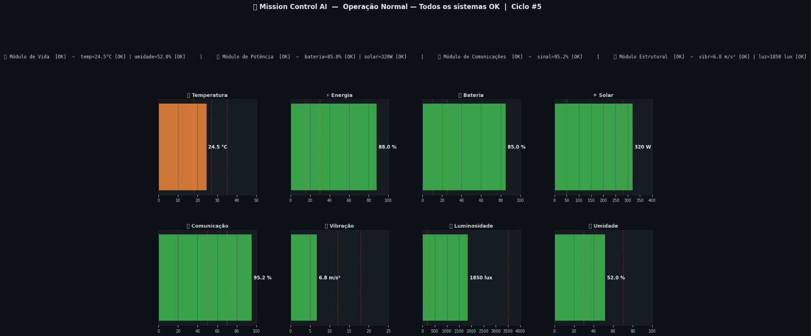
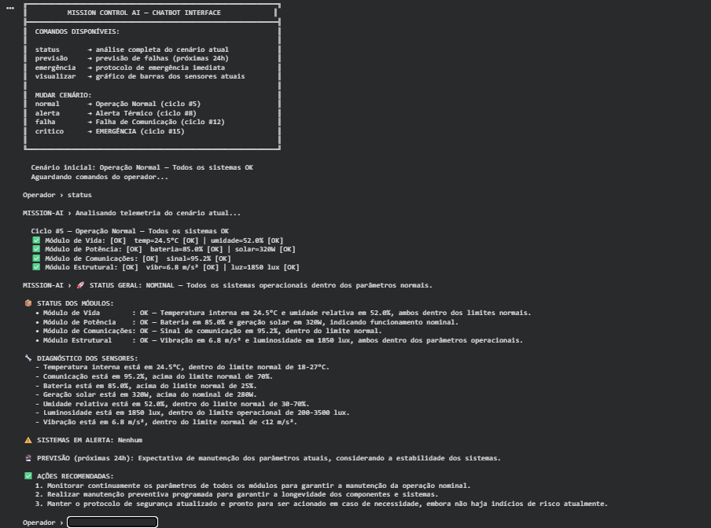

# Mission Control AI — GS 2026.1
### Sistema Inteligente de Monitoramento de Missão Espacial

> **FIAP — Global Solution 2026.1 | Space Connect**

---

## 👨‍🚀 Integrantes

| RM | Nome |
|----|------|
| 571836 | Bruna Yukimy Hada |
| 571562 | Denize Ferrante |
| 572395 | Gabriel Dias Menezes |

---

## 📌 Resumo do Projeto

Projeto acadêmico que implementa um sistema experimental de monitoramento para uma cápsula espacial. Desenvolvido em Python e usando LLaMA 3.3 via Groq para gerar análises e decisões automatizadas a partir de telemetria simulada (temperatura, energia, comunicação, oxigênio, luminosidade e vibração). O repositório também contém um módulo de análise oceânica que processa séries do NOAA ONI para detectar sinais de El Niño / La Niña.

O objetivo é demonstrar como técnicas de Prompt Engineering combinadas com modelos de grande porte podem automatizar monitoramento e suporte à decisão em missões espaciais e estudos ambientais.

---

## 🖥️ Demonstração

### Análise normal da cápsula (todos os sistemas OK)


### Alerta crítico — situação de emergência


### Dashboard mostrando os dados da cápusla


### Demonstração do chatbot funcionando


Vídeo demonstrativo: [▶️ Demonstração (YouTube)](https://youtu.be/hJtJuzijPu0)

---

## ⚙️ Funcionalidades principais

- **Monitoramento da cápsula:** temperatura, energia, comunicação, oxigênio, luminosidade e vibração
- **Alertas automáticos:** estados OK / ALERTA / CRÍTICO com limiares configuráveis
- **Ações automatizadas:** ex.: energia < 20% → modo economia; falha de comunicação → fallback de telemetria
- **Módulo OCEAN-AI:** análise de séries ONI para identificar eventos climáticos (El Niño / La Niña)
- **Várias demos de Prompt Engineering** dentro do notebook para ilustrar comportamento do modelo

---

## 🤖 Modelo e configuração de inferência

- **Modelo:** llama-3.3-70b-versatile (via Groq)
- **Fornecedor:** Groq (API)
- **Temperatura:** 0.3 (configuração sugerida)
- **Max tokens por resposta:** 900
- **Context window:** até 128k tokens (configuração usada no notebook)

---

## 🔬 Técnicas de Prompt Engineering usadas

- **Role Prompting:** separação de papéis MISSION-AI e OCEAN-AI
- **Constraint Specification:** limiares operacionais embutidos no prompt
- **Structured Data Injection:** telemetria e séries temporais estruturadas
- **Chain-of-Thought:** raciocínio passo-a-passo em exemplos críticos
- **Few-Shot / Exemplos:** calibragem para previsões e diagnósticos
- **Variational Prompting:** demonstração do efeito de `temperature`

---

## 🗂 Estrutura do repositório

```
missionControl/
├── assets/                       # imagens e gráficos usados no notebook
│   ├── demo_normal.png
│   ├── demo_alerta.png
│   ├── grafico1_histograma_sst.png
│   └── grafico2_serie_historica.png
├── mission_control_ia.ipynb      # notebook principal com demos e execução
├── README.md
```

---

## ▶️ Como executar o projeto (rápido)

1. Acesse o Google Colab:  
   👉 https://colab.research.google.com  
   Em seguida, faça upload do arquivo `mission_control_ia.ipynb`.

---

2. 🔑 Configuração da chave de API (obrigatório)

Para que a aplicação funcione corretamente, é necessário criar e configurar uma chave de API da Groq com o nome:
```bash
GROQ_API_KEY
```

No Google Colab, você pode fazer isso de duas formas:

### ✔️ Opção 1 — Usando Secrets (recomendado)
Vá em:
```bash
Ferramentas > Secrets (ou Ambiente de execução > Secrets)
```

Adicione:
- **Nome:** `GROQ_API_KEY`
- **Valor:** sua chave da Groq

🔗 Obter chave: https://console.groq.com/keys

---

### ✔️ Opção 2 — Definição manual no notebook
Execute no início do notebook:

```python
import os
os.environ["GROQ_API_KEY"] = "SUA_CHAVE_AQUI"
Ou,no Colab, configure a variável de ambiente GROQ_API_KEY nos Secrets (ou defina antes de executar):

```

3. Execute as células em ordem — o notebook instala dependências e demonstra 7 cenários (normal, alerta térmico, emergência, análise ONI, etc.).

Observações:
- O modelo roda via API Groq — não é necessária GPU local.
- Recomendado Python 3.10+ quando executar localmente (se desejar).

---

## Desenvolvimento local (opcional)

- Criar um virtualenv Python 3.10+ e instalar dependências (quando houver `requirements.txt`).
- Ajustar `GROQ_API_KEY` em variáveis de ambiente antes de executar scripts locais.

---

## Referências e recursos

- Console Groq: https://console.groq.com/keys
- NOAA ONI (dados usados no notebook): https://www.ncdc.noaa.gov/teleconnections/enso/indics/oni

---

Projeto acadêmico — FIAP Global Solution 2026.1 | Uso educacional
