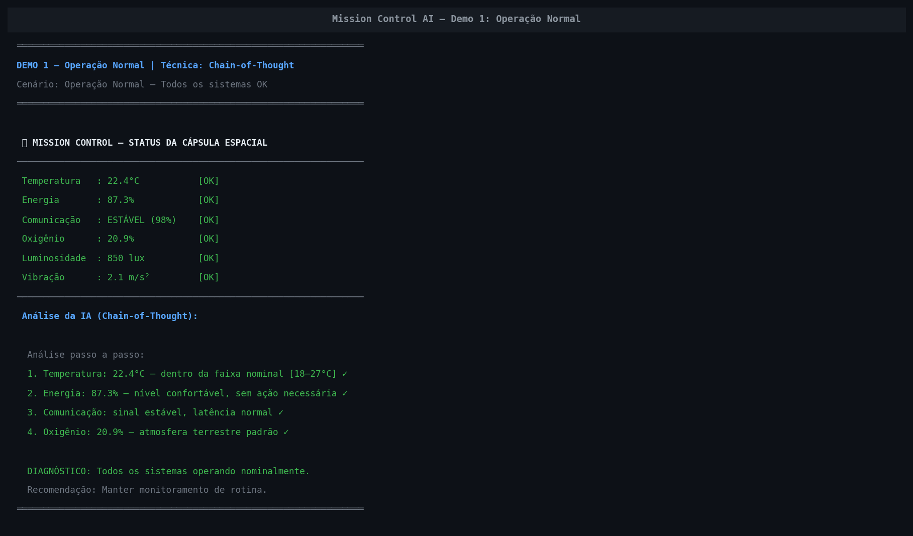
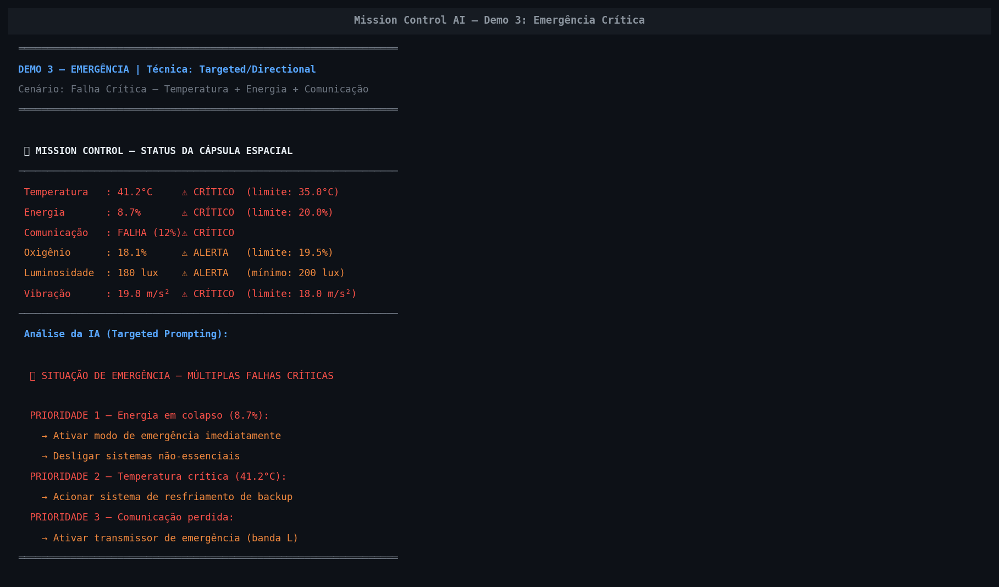

# Mission Control AI — GS 2026.1
### Sistema Inteligente de Monitoramento de Missão Espacial

> **FIAP — Global Solution 2026.1 | Space Connect**  
> Ciências da Computação — 1º Ano | 1º Semestre de 2026

---

## 👨‍🚀 Integrantes

| RM | Nome |
|----|------|
| 571836 | Bruna Yukimy Hada |
| 571562 | Denize Ferrante |
| 572395 | Gabriel Dias Menezes |

---

## 📌 O que o projeto faz

Sistema inteligente de monitoramento de missão espacial experimental construído com **Python + LLaMA 3.3 (via Groq)**. O sistema interpreta dados simulados de temperatura, energia, comunicação, oxigênio, luminosidade e vibração de uma cápsula espacial, gerando alertas automáticos e análises via IA quando parâmetros saem dos limites operacionais.

Além do monitoramento da cápsula, o sistema inclui um módulo de **análise oceânica** que processa dados reais do **NOAA ONI** (coletados por satélites NASA) para detectar eventos El Niño / La Niña — demonstrando como IA e dados espaciais se integram ao controle de missões com impacto ambiental real.

---

## 🖥️ Demonstração

### Análise normal da cápsula (todos os sistemas OK)


### Alerta crítico — situação de emergência


---

## ⚙️ Funcionalidades

### 🚀 Módulo 1 — Cápsula Espacial (`gs_prompt_ia.ipynb`)
- **Monitoramento de 6 parâmetros:** temperatura, energia, comunicação, oxigênio, luminosidade, vibração
- **Alertas automáticos** (OK / ALERTA / CRÍTICO) com limiares operacionais definidos
- **Lógica de decisão:** ex: energia < 20% → ativa modo de economia
- **7 demonstrações** com técnicas diferentes de Prompt Engineering:
  - Demo 1: Operação Normal — Chain-of-Thought
  - Demo 2: Alerta Térmico — Few-Shot (previsão de falha)
  - Demo 3: Emergência — Targeted/Directional Prompting

---

## 🤖 Modelo de IA

| Item | Detalhe |
|------|---------|
| Modelo | `llama-3.3-70b-versatile` (LLaMA 3.3 — 70B parâmetros) |
| Provedor | **Groq** (inferência via API) |
| Temperatura | 0.3 (respostas consistentes e precisas) |
| Max tokens | 900 por resposta |
| Context window | 128k tokens |

---

## 🔬 Técnicas de Prompt Engineering utilizadas

| Técnica | Aplicação |
|---------|-----------|
| **Role Prompting** | MISSION-AI e OCEAN-AI com papéis definidos |
| **Constraint Specification** | Limiares operacionais injetados no prompt |
| **Structured Data Injection** | Dados da cápsula/oceano em formato estruturado |
| **Chain-of-Thought** | IA raciocina passo a passo sobre o status |
| **Few-Shot Prompting** | Exemplos de análise anteriores para calibrar resposta |
| **Variational Prompting** | Efeito do parâmetro `temperature` demonstrado |
| **Targeted/Directional** | Prompts focados em situações críticas específicas |

---

## 🗂️ Estrutura do Repositório

```
GlobalSolution/
├── assets/                            ← prints e imagens do sistema
│   ├── demo_normal.png
│   ├── demo_alerta.png
│   ├── grafico1_histograma_sst.png
│   └── grafico2_serie_historica.png
├── mission_control_ia.ipynb 
├── README.md  

```

---

## ▶️ Como Executar


### 1. Acesse o notebook no Google Colab:  
   **[🔗 Abrir no Google Colab](https://colab.research.google.com)**  
   *(fazer upload do arquivo `mission_control_ia.ipynb`)*

### 2. Configure a chave da API Groq nos **Secrets do Colab** (🔑):
   - Nome: `GROQ_API_KEY`  
   - Valor: sua chave em [console.groq.com/keys](https://console.groq.com/keys) (gratuita)

### 3. Execute todas as células em ordem — o sistema baixa dependências automaticamente

> O modelo LLaMA 3.3 70B roda via API Groq — sem GPU necessária, sem instalação local.


---

## 🎬 Vídeo de Demonstração

[▶️ Assistir ao vídeo](https://youtu.be/SEU_LINK_AQUI)

---

## 🛠️ Tecnologias

- **Python 3.10+**
- **Groq SDK** — inferência LLaMA 3.3 70B
- **Google Colab** — ambiente de execução

---

> Projeto acadêmico — FIAP Global Solution 2026.1 | Uso educacional
